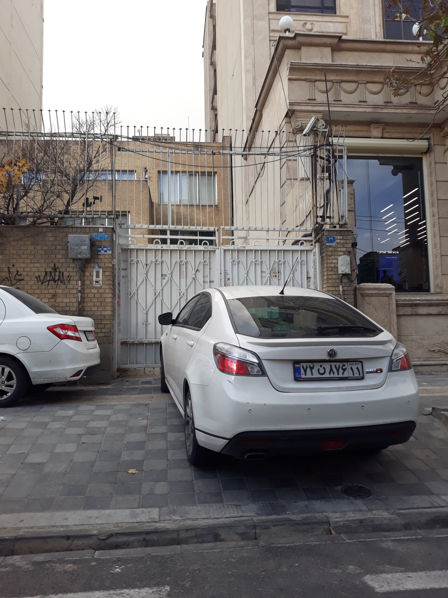
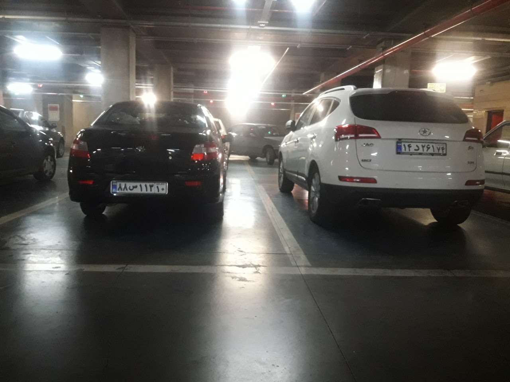
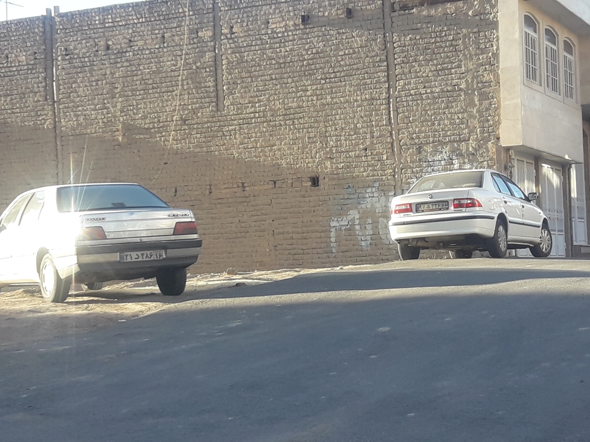
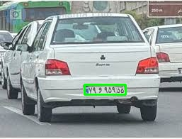

# 🚗 License Plate Detection with YOLOv9

This project is a **real-time Iranian license plate detection system** powered by **YOLOv9**.
It can detect and localize license plates from live webcam feeds or static images.

---

## 🗂️ Dataset Description

The dataset used for training is a collection of **Iranian license plate images**, including:

* **Training set**: 29,342 images
* **Validation set**: 4,240 images
* **Test set**: 8,352 images

Each image is labeled with **bounding boxes around license plates** and the digits/letters.

### Sample Images from Dataset:

    
      
  

The dataset provides a wide variety of conditions, including **daytime/nighttime**, different **angles**, and **varied lighting**, making it ideal for training a robust model.

---

## 🤖 Why YOLOv9?

We selected **YOLOv9m** for this project because:

* **Real-time performance**: Fast inference suitable for live webcam detection
* **Good accuracy**: Pretrained weights on COCO help detect objects with small datasets
* **Flexibility**: Easily fine-tuned on custom datasets like license plates
* **Lightweight**: Medium-size model (`yolov9m`) balances speed and precision

---

## ⚡ Installation

1. Clone this repository:

```bash
git clone https://github.com/AmirSalajegheh/IR-LPR.git
cd IR-LPR
```

2. Install dependencies:

```bash
pip install -r requirements.txt
```

3. Make sure **PyTorch** is installed with CUDA support if you plan to use a GPU.

---

## 🚀 Usage

### Run with Webcam:

```bash
python main.py
```

### Train the Model:

Open `training.ipynb` in Jupyter Notebook or Google Colab and follow the steps to train on your dataset.

---

## 📊 Example Results

After running `main.py`, results will be saved in the `Data/` folder.

  

---

## 🛠️ Tech Stack

* [PyTorch](https://pytorch.org/)
* [Ultralytics YOLOv9](https://github.com/ultralytics/ultralytics)
* [OpenCV](https://opencv.org/)

---

## 👨‍💻 Author

Developed by **Amir Salajegheh** 🚀
